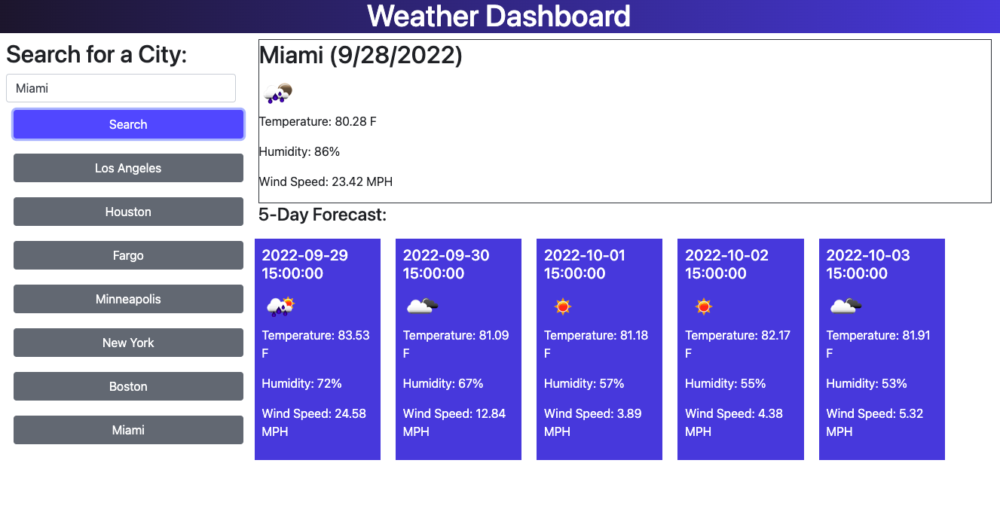

# Weather Dashboard

## Description
The Weather Dashboard is an application that utilizes the third-party OpenWeather Map API. Data is retrieved from this API in order to provide the user with the ability to browse the weather for cities of their choosing.

A dynamically updated UI uses HTML, CSS, and JavaScript to accomplish the task of providing the user with the weather data for their search.

A date utility library (Moment.js) is used to manage the date and time, allowing the app to reflect an accurate display in real time. 

## Installation

N/A

## Usage

The Weather Dashboard is perfect for users that are planning to travel and would like to view weather data for their trip.

The dashboard is easy to use and features 3 main components:

First, the user is presented with a text entry box and a search button.

* After entering a city name and hitting the search button, the current weather for that city is displayed at the top.
* The current weather section features the city name, current date, and a weather icon. It also displays the current temperature, humidity, and wind speed.

A section containing the 5-day forecast for that city is displayed beneath the current weather section.

* This section displays the weather forecast for the next 5 consecutive days.
* Just like the current weather section, each day in the 5-day forecast contains the following information: the date, a weather icon, the temperature, humidity, and wind speed.

The user has the ability to search for multiple cities. Each city entered into the search gets saved in the form of a button, which displays beneath the primary search button.

* Weather data for the previously searched cities can be displayed again by simply clicking on the button.

## Credits

N/A

## Link to Deployed Website

[Weather Dashboard](https://smdann.github.io/weather-dashboard/)

## License

MIT License

Copyright (c) 2022 smdann

Please refer to the license in the repo for more information.